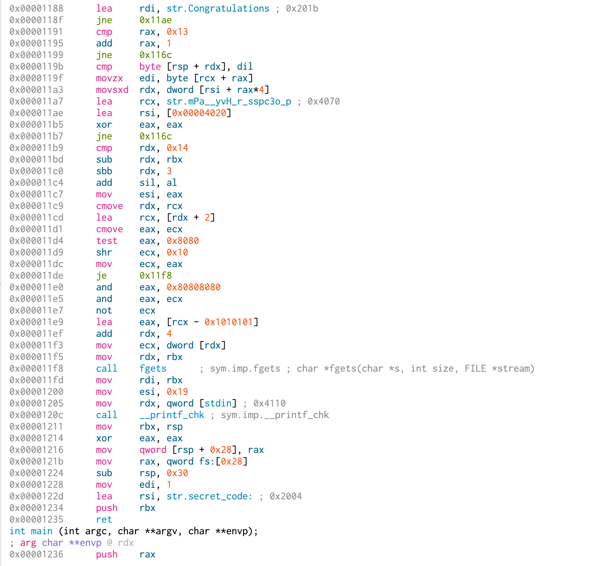

# rev
Author: `Cerulime` & `Ben`
## Desciption
esreveR
## 正经解法
1. 用你喜欢的逆向工具反汇编一下

 

发现没法反编译，寄！（RE不能反编译不如打游戏，开摆！）
DeadCells 启动！

2. 硬刚汇编。嗯？？？ secret code  怎么会在 congratualation 后面出现？？
正着读狗屁不通，反着读合情合理。
3. なるほど！这不就easy了嘛，一眼出流程图，下一题下一题
4. 根据分析汇编画出流程图，可以看出在check输入的循环中，程序从`0x000004020`取值放入rsi，从疑似flag的字符串中取值放入rcx并比较，于是乎查看`0x00004020`。
5. 看懂力！跑个脚本，把数组拉下来作为字串的索引，直接出答案

## 非预期解法
1. 用ida反汇编 shift+f12查看字串，发现疑似flag，根据flag格式盲猜flag为`compass{H@Ppy_r3v!}`。
2. 提交发现错误，将大小p换位，提交！Correct！

flag: `compass{H@pPy_r3v!}`